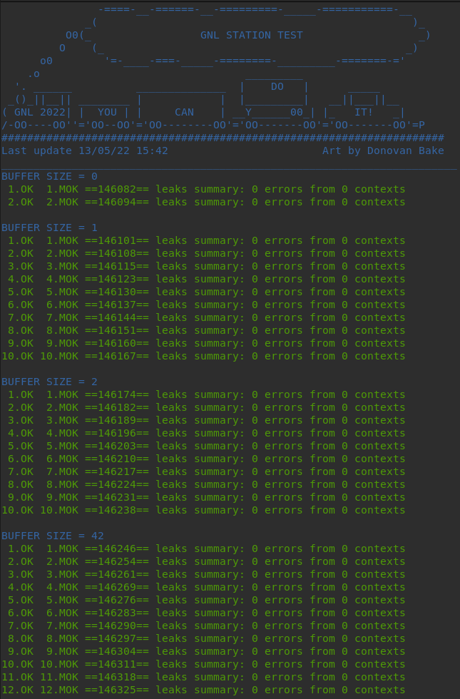
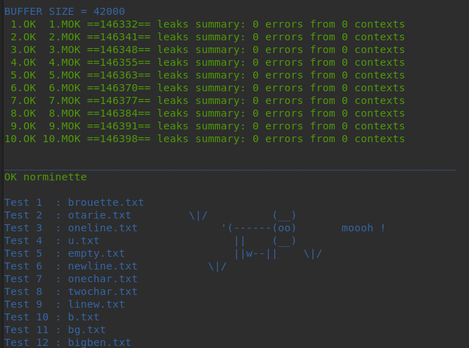
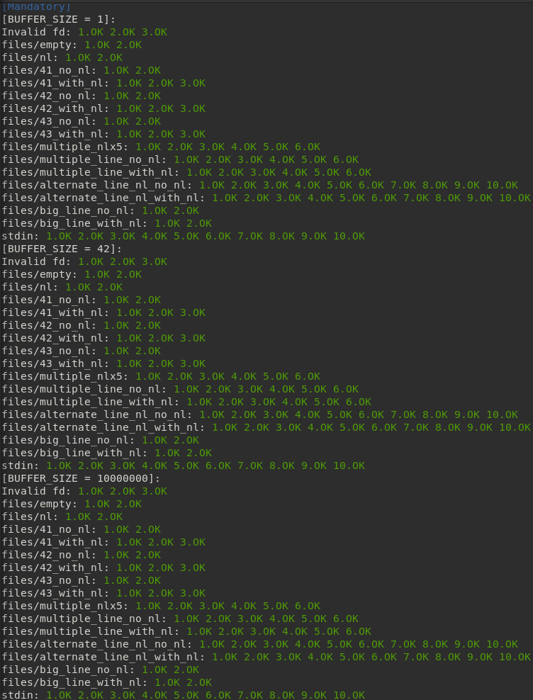
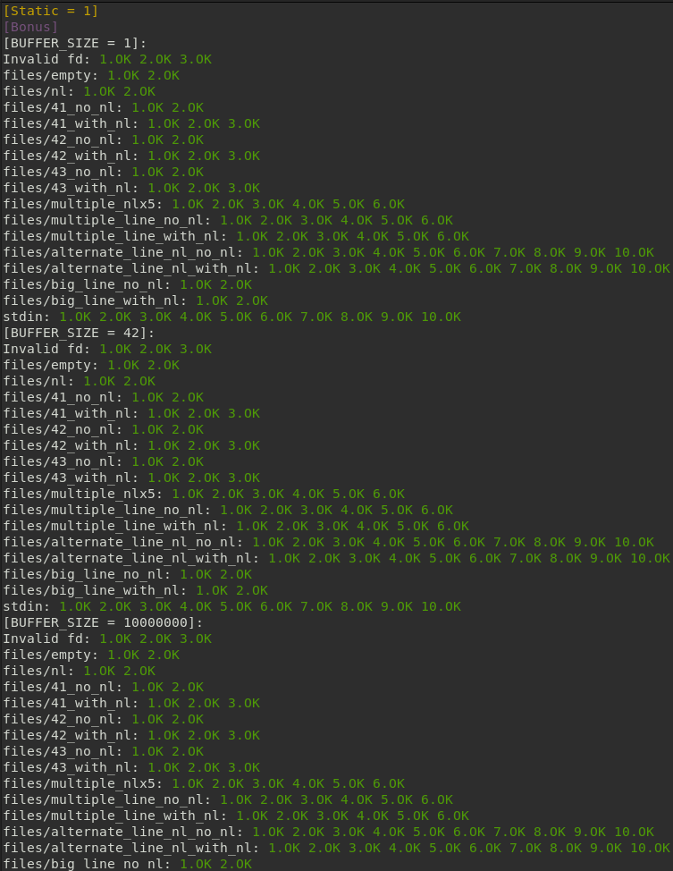
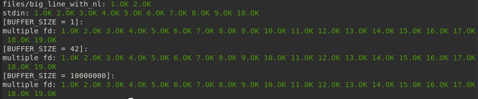

# 42cursus_lvl1_Get_next_line
# Grade: 100/100
### Subject: [click here](Extras/en.subject.pdf)
This repository includes all the files and functions from the get_next_line individual project from 42 cursus (level 1).  
The goal of the project is to create a function that is able to read from a file, and return line by line according to the number of times the function is called.

### To run the project:
1 - Clone the repository: 
`git clone https://github.com/carolinaaasf/42cursus_lvl1_Get_next_line.git`

### Testing:
For this project, I ran 2 testers created by other users, which results and repositories are the ones below: 
#### [gnl-station-tester](https://github.com/kodpe/gnl-station-tester)  
  
  

#### [gnlTester](https://github.com/Tripouille/gnlTester)  
##### (with TIMEOUT set to 500000)  
  
  
  
--------
Made by Carolina Figueiredo (carolinaaasf) | csilva-f@student.42porto.com  
LinkedIn: https://www.linkedin.com/in/carolina-silva-figueiredo/
